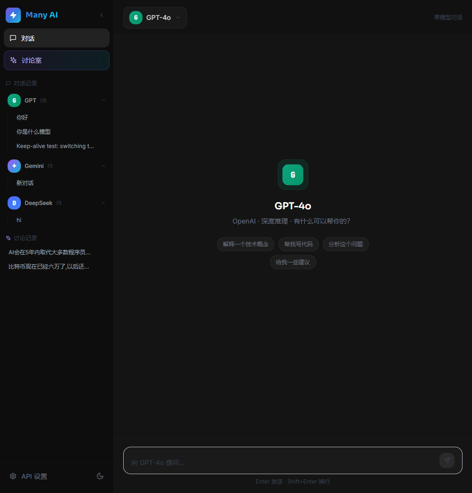
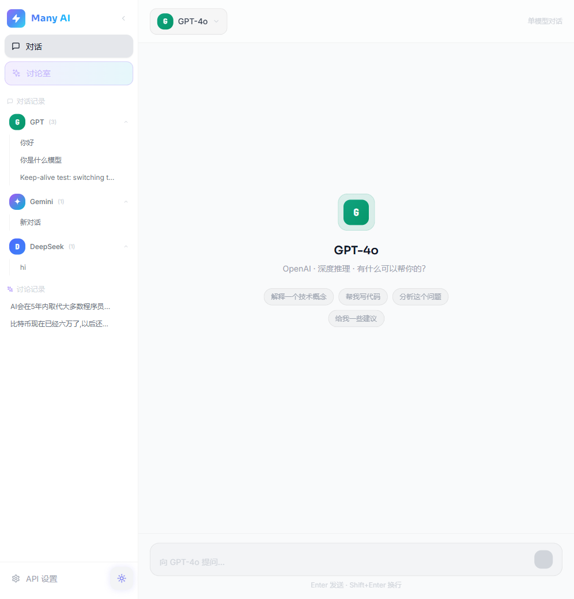
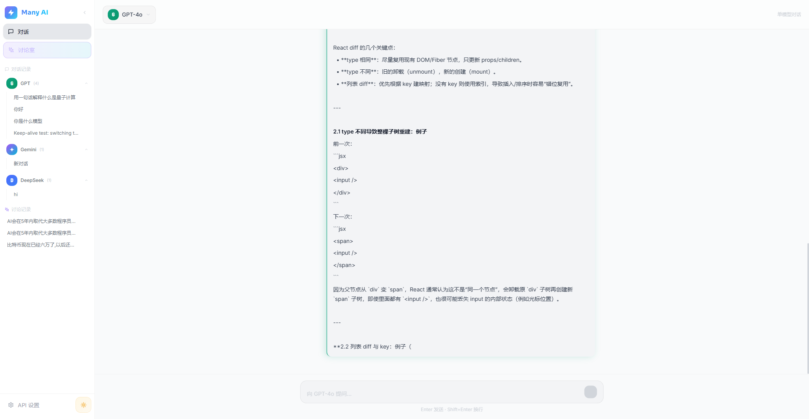
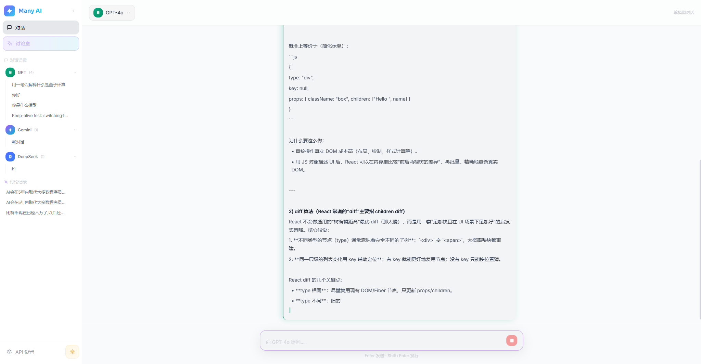

<div align="center">

<h1>🔮 Quorum</h1>

<p><strong>多模型 AI 对话平台 · 群聊讨论 · 共识生成</strong></p>

<p>
  
  
  
  
  
  
</p>

<p>
  <a href="#-快速上手">快速上手</a> ·
  <a href="#-功能特性">功能特性</a> ·
  <a href="#-技术栈">技术栈</a> ·
  <a href="#-项目结构">项目结构</a>
</p>

</div>

---

## 📸 界面预览

<table>
  <tr>
    <td align="center"><strong>🌙 深色主题</strong></td>
    <td align="center"><strong>☀️ 浅色主题</strong></td>
  </tr>
  <tr>
    <td></td>
    <td></td>
  </tr>
  <tr>
    <td align="center"><strong>💬 对话流式输出</strong></td>
    <td align="center"><strong>⏹ 实时生成 & 停止</strong></td>
  </tr>
  <tr>
    <td></td>
    <td></td>
  </tr>
</table>

---

## ✨ 功能特性

### 🗣️ 单模型对话
与你喜欢的 AI 模型（GPT-4o、Gemini、Grok、DeepSeek）进行流式对话，支持 Markdown 渲染、代码高亮、LaTeX 公式。

### 🤖 多模型群聊讨论（Multi-Agent）
将一个话题同时抛给多个 AI 模型，它们会进行多轮并行讨论，最终收敛出一份**多方共识摘要**。看 AI 们如何辩论、互补、达成一致。

### 🌐 实时联网搜索
一键开启联网搜索（Tavily / DuckDuckGo 备选），AI 回复中自动嵌入带编号的引用标签 `[1]`，点击即可跳转原始来源网页。

### 📎 文件 & 图片附件（多模态）
支持上传图片和文本文档。图片通过 Vision API 处理，文本自动注入上下文——单聊和群聊中均可使用。

### 💡 无缝追问
即使在群聊达成共识后，你仍然可以继续向多模型面板追问，支持联网搜索和附件。

### 🔐 用户数据隔离
基于 Supabase Auth + Row Level Security（RLS），你的会话历史和数据严格私有，仅对自己可见。

### ⚡ Keep-Alive 架构
在「对话」和「讨论室」视图之间自由切换，不会中断正在进行的 AI 流式生成。

### 🎨 高对比度主题
精心调校的深色 / 浅色两套主题，搭配丝滑的 Spring 动画过渡和无障碍对比度。

---

## 🏗️ 技术栈

| 层级 | 技术 |
|------|------|
| **前端** | React 18 + TypeScript + Vite + Tailwind CSS + Zustand |
| **后端** | Python 3.12 + FastAPI + SSE 流式推送 |
| **数据库** | Supabase (PostgreSQL) + Row Level Security |
| **AI 接口** | OpenAI 兼容代理、Tavily 搜索 API |
| **认证** | Supabase Auth + JWT（PyJWT） |
| **测试** | pytest + pytest-asyncio |

---

## 🚀 快速上手

### 前置要求
- Python 3.11+
- Node.js 18+
- 一个 [Supabase](https://supabase.com) 项目

### 1. 克隆 & 配置

```bash
git clone https://github.com/qd-maker/Quorum.git
cd Quorum
cp .env.example .env
```

编辑 `.env` 文件，填入你的 API 端点和 Supabase 配置：

```env
# AI 模型 API
API_BASE_URL=https://api.openai.com/v1   # 或兼容代理地址
API_KEY=sk-...

# Supabase
SUPABASE_URL=https://xxx.supabase.co
SUPABASE_KEY=<anon key>
SUPABASE_SERVICE_KEY=<service_role key>
SUPABASE_JWT_SECRET=<JWT secret>

# CORS（生产环境按需修改）
CORS_ORIGINS=http://localhost:5173,http://127.0.0.1:5173

# 可选：联网搜索
TAVILY_API_KEY=tvly-...
```

### 2. 数据库迁移

在 Supabase SQL Editor 中执行以下 SQL 来创建表结构和 RLS 策略：

```sql
CREATE TABLE IF NOT EXISTS sessions (
  id UUID DEFAULT gen_random_uuid() PRIMARY KEY,
  user_id UUID,
  type TEXT NOT NULL CHECK (type IN ('chat', 'discuss')),
  title TEXT NOT NULL DEFAULT '',
  preview TEXT NOT NULL DEFAULT '',
  model TEXT, topic TEXT, consensus TEXT,
  created_at TIMESTAMPTZ DEFAULT now(),
  updated_at TIMESTAMPTZ DEFAULT now()
);

CREATE TABLE IF NOT EXISTS messages (
  id UUID DEFAULT gen_random_uuid() PRIMARY KEY,
  session_id UUID NOT NULL REFERENCES sessions(id) ON DELETE CASCADE,
  role TEXT NOT NULL, content TEXT NOT NULL DEFAULT '',
  model TEXT, round INT,
  created_at TIMESTAMPTZ DEFAULT now()
);

ALTER TABLE sessions ENABLE ROW LEVEL SECURITY;
ALTER TABLE messages ENABLE ROW LEVEL SECURITY;
CREATE POLICY allow_all_sessions ON sessions FOR ALL USING (true) WITH CHECK (true);
CREATE POLICY allow_all_messages ON messages FOR ALL USING (true) WITH CHECK (true);

CREATE INDEX IF NOT EXISTS idx_sessions_user_id ON sessions (user_id);
```

### 3. 启动后端

```bash
cd backend
python -m venv .venv
# Windows: .\.venv\Scripts\activate
# macOS/Linux: source .venv/bin/activate
pip install -r requirements.txt
uvicorn main:app --reload --port 8000
```

### 4. 启动前端

```bash
cd frontend
npm install
npm run dev
```

打开 `http://localhost:5173`，注册账号后即可开始对话！

### 5. 运行测试

```bash
cd backend
pytest -v
```

---

## 📁 项目结构

```
Quorum/
├── backend/
│   ├── main.py                # FastAPI 入口
│   ├── config.py              # 环境变量配置
│   ├── routers/
│   │   ├── chat.py            # 单模型对话 API
│   │   ├── discuss.py         # 群聊讨论 API
│   │   ├── history.py         # 历史记录 CRUD
│   │   ├── config_api.py      # API 配置管理（需认证）
│   │   └── auth_router.py     # 认证路由
│   ├── services/
│   │   ├── orchestrator.py    # 多模型并行编排器
│   │   ├── search_service.py  # Tavily/DDG 联网搜索
│   │   ├── model_service.py   # LLM 推理流
│   │   └── history_service.py # Supabase 历史记录服务
│   └── tests/
│       ├── conftest.py        # 测试夹具
│       ├── test_chat.py       # 对话 API 测试
│       └── test_orchestrator.py # 编排器测试
├── frontend/
│   ├── src/
│   │   ├── components/        # UI 组件（Sidebar, ModelBubble 等）
│   │   ├── pages/             # 页面（ChatPage, DiscussPage, AuthPage）
│   │   ├── lib/api.ts         # SSE & Fetch 封装
│   │   └── context/           # Auth & 状态管理
│   └── vite.config.ts
├── docs/screenshots/          # 项目截图
├── .env.example               # 环境变量模板
└── docker-compose.yml         # Docker 编排（可选）
```

---

## 🔧 核心设计

### 流式 SSE 架构
后端使用 FastAPI 的 `StreamingResponse` + Server-Sent Events，前端通过 `EventSource` 实时消费，实现打字机效果的流式输出。

### 多模型编排器
`orchestrator.py` 实现了多轮并行讨论机制：
1. **并行请求** — 同时向多个模型发起推理
2. **多轮辩论** — 每轮的回复作为下一轮的上下文
3. **共识生成** — 最终一轮由指定模型汇总各方观点，输出结构化共识

### 用户隔离
- Supabase Auth 处理注册/登录
- JWT Token 验证每个 API 请求
- `user_id` 字段确保数据行级隔离

---

## 🤝 贡献

欢迎提交 PR！如涉及较大的架构变更，请先开 Issue 讨论。

---

## 📄 License

MIT
