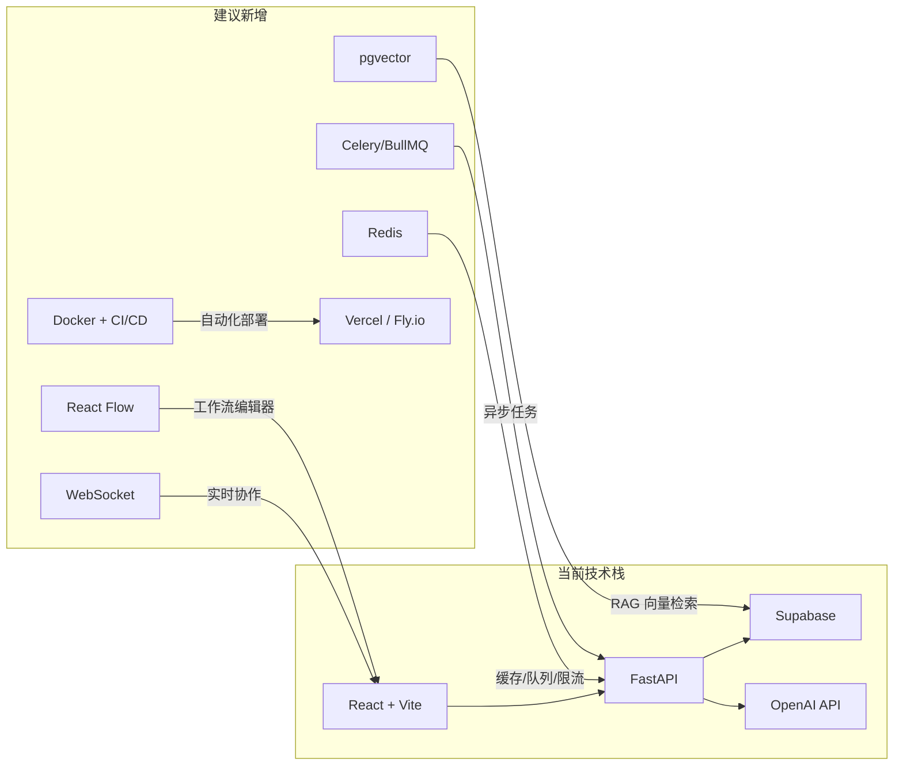

# Quorum 产品进化路线图

## 1. 产品重新定位

**现状**：多模型聊天 + 群聊共识 → 本质上是一个 UI 壳子  
**目标**：**AI 协作决策平台** — 让多个 AI 不只是"聊天"，而是真正协作完成复杂任务

> [!IMPORTANT]
> 核心差异化命题：**从"多模型聊天"进化为"多 Agent 协作工作流"**。  
> 面试叙事从"我调了几个 API"变为"我设计了一套 Multi-Agent 协作系统"。

---

## 2. 分阶段功能路线图

### P0 — 夯实基础，补齐短板（1-2 周）

| 功能 | 亮点 | 面试加分点 |
|------|------|-----------|
| **Prompt 模板市场** | 用户可创建、分享、一键加载 Prompt 模板 | CRUD + 社区 UGC 模式 |
| **对话导出** | 支持导出为 Markdown / PDF / 分享链接 | 文件生成 + 短链服务 |
| **Token 用量追踪** | 实时显示每次请求的 token 消耗和成本 | 可观测性 + 成本意识 |
| **流式 Markdown 渲染优化** | 代码块语法高亮、Mermaid 图表实时渲染 | 前端性能优化 |

---

### P1 — 核心差异化功能（2-4 周）

#### 🧠 Multi-Agent 工作流引擎
```
用户定义 DAG 工作流 → 多个 Agent 按步骤执行 → 中间结果可编辑 → 最终输出
```
- **可视化工作流编辑器**（拖拽式，类 n8n / Dify）
- 预置模板：代码审查流水线、竞品分析、论文精读
- 技术栈加分：**React Flow** + DAG 调度 + 状态机

#### ⚖️ AI 评测竞技场（Model Arena）
- 同一问题 → 两个模型盲测对比 → 用户投票选优
- 积累社区评分数据，生成 ELO 排行榜
- 技术栈加分：**ELO 算法** + 数据可视化 + 众包评测

#### 🔌 RAG 知识库
- 用户上传文档（PDF/Notion）→ 向量化存储 → 对话时检索增强
- 技术栈加分：**pgvector** + embedding 模型 + chunking 策略 + 混合检索

#### 🤖 自定义 Agent
- 用户创建带人设、工具、知识库的自定义 Agent
- Agent 可参与群聊讨论，替代默认模型
- 技术栈加分：**Function Calling** + Tool Use + Agent 生命周期管理

---

### P2 — 高阶能力，拉开差距（4-8 周）

| 功能 | 描述 | 技术深度 |
|------|------|---------|
| **MCP 协议集成** | 让 Agent 连接外部工具（GitHub、Jira、DB） | Model Context Protocol |
| **实时协作** | 多人同时参与 AI 讨论，类 Google Docs | WebSocket + CRDT / OT |
| **语音交互** | 语音输入 + TTS 朗读回复 | Web Speech API / Whisper |
| **插件市场** | 第三方开发者可编写插件扩展功能 | 插件沙箱 + API 网关 |
| **AI Agent 记忆系统** | 跨会话长期记忆，自动总结用户偏好 | 向量存储 + 摘要链 |

---

## 3. 技术栈演进建议



### 推荐新增技术栈及理由

| 技术 | 用途 | 面试叙事 |
|------|------|---------|
| **Redis** | SSE 连接管理、速率限制、缓存 | "我用 Redis 做了分布式限流和会话缓存" |
| **pgvector** | RAG 向量检索（Supabase 原生支持） | "我实现了混合检索的 RAG 流水线" |
| **Celery / BullMQ** | 异步长任务处理（工作流执行） | "我设计了异步 DAG 任务调度系统" |
| **React Flow** | 可视化工作流编辑器 | "我用 React Flow 构建了拖拽式 Agent 编排" |
| **WebSocket** | 实时多人协作 | "我实现了基于 WebSocket 的实时协作" |
| **Docker + GitHub Actions** | CI/CD 自动化 | "完整的 DevOps 流水线" |
| **Prometheus + Grafana** | 监控告警 | "端到端可观测性" |

---

## 4. 产品最终形态

> **Quorum = Dify（工作流）+ ChatGPT（对话）+ Chatbot Arena（评测）+ Notion AI（知识库）**

一句话电梯演讲：

> *"Quorum 是一个 Multi-Agent 协作平台，支持多模型并行讨论、可视化工作流编排、RAG 知识库、和社区驱动的模型评测竞技场。"*

### 面试时的技术叙事矩阵

| 面试话题 | 你可以聊什么 |
|----------|-------------|
| **系统设计** | Multi-Agent DAG 调度、SSE/WS 实时通信、分布式任务队列 |
| **数据库设计** | pgvector 混合检索、RLS 多租户隔离、会话状态机 |
| **前端工程** | React 性能优化（虚拟列表、流式渲染）、拖拽编辑器、PWA |
| **后端工程** | 异步并发模型（asyncio + Celery）、API 网关、速率限制 |
| **AI/ML** | Prompt Engineering、RAG 流水线、embedding 策略、评测体系 |
| **DevOps** | Docker 编排、CI/CD、监控告警、蓝绿部署 |

---

## 5. 我的推荐优先级

如果时间有限，**最高 ROI 的三个功能**：

1. **🧠 Multi-Agent 工作流引擎** — 这是最强差异化点，面试时一讲"DAG 编排 + 可视化"立刻拉开档次
2. **🔌 RAG 知识库** — 业界最热门话题，Supabase 原生支持 pgvector，实现成本低
3. **⚖️ Model Arena 评测** — 独特卖点，有数据积累价值，展示产品思维

> [!TIP]
> 这三个功能组合起来，项目叙事就从"API 聚合器"变成了"AI 基础设施平台"，在面试中的含金量完全不同。
